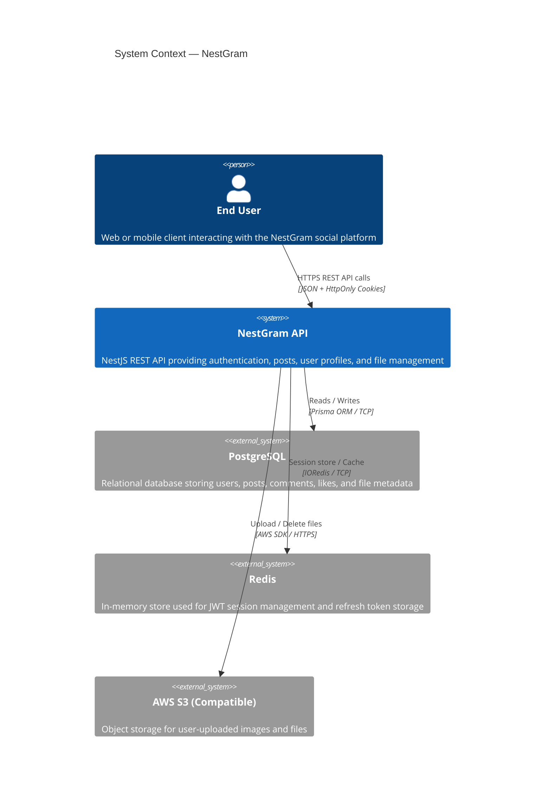
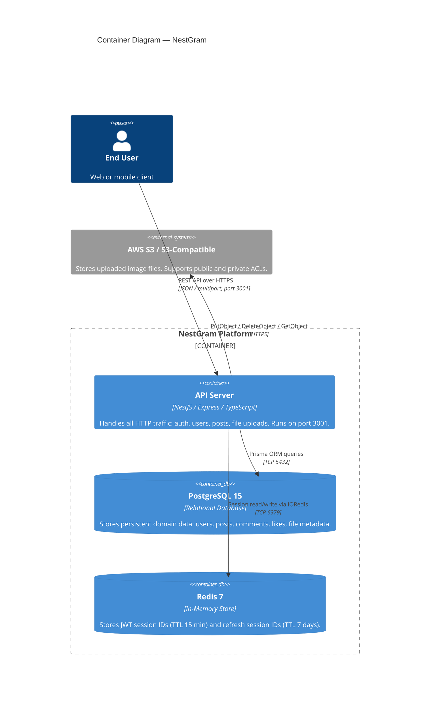
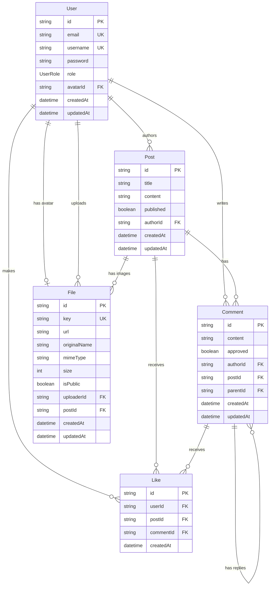
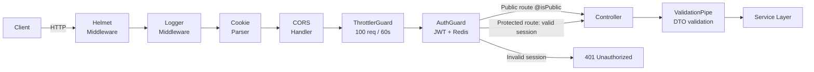

# NestGram — C4 Model

> Generated: 2026-03-09

---

## Table of Contents

1. [Level 1 — System Context](#level-1--system-context)
2. [Level 2 — Container Diagram](#level-2--container-diagram)
3. [Level 3 — Component Diagram (API Server)](#level-3--component-diagram-api-server)
4. [Database Schema (ER Diagram)](#database-schema-er-diagram)
5. [Request Middleware Chain](#request-middleware-chain)
6. [Security Architecture Summary](#security-architecture-summary)

---

## Level 1 — System Context

Who uses the system and what external systems does it depend on.

---

## Level 2 — Container Diagram

How the system is decomposed into deployable units.

**Docker Compose Services:**

| Service     | Image             | Internal Port | Purpose                                |
|-------------|-------------------|---------------|----------------------------------------|
| `nest-bff`  | Custom Dockerfile | 3001          | NestJS API server                      |
| `postgres`  | `postgres:15`     | 5432          | Primary relational database            |
| `redis`     | `redis:7`         | 6379          | Session store / cache                  |
| `migrate`   | `nest-bff`        | —             | One-shot: runs `prisma migrate deploy` |

---

## Level 3 — Component Diagram (API Server)

Internal structure of the NestJS API container.

```mermaid
C4Component
    title Component Diagram — NestGram API Server

    Person(user, "End User")

    Container_Boundary(api, "API Server (NestJS)") {

        Component(helmet, "Helmet Middleware", "NestJS Middleware", "Applies HTTP security headers (CSP, HSTS, X-Frame-Options, etc.)")
        Component(logger, "Logger Middleware", "NestJS Middleware", "Logs every HTTP request: method, path, status, duration, IP")
        Component(throttler, "ThrottlerGuard", "NestJS Guard", "Rate limits: 100 requests per 60 seconds per IP")
        Component(auth_guard, "AuthGuard (APP_GUARD)", "NestJS Guard (Global)", "Validates JWT from cookie + cross-checks session ID in Redis. Skips @Public() routes.")

        Component(auth_ctrl, "AuthController", "NestJS Controller", "POST /v1/auth/signup, signin, refresh, logout, validate")
        Component(user_ctrl, "UserController", "NestJS Controller", "GET /v1/users/me, GET /v1/users/:id/posts")
        Component(post_ctrl, "PostController", "NestJS Controller", "POST /v1/posts")
        Component(file_ctrl, "FileController", "NestJS Controller", "POST /v1/file/upload (multipart)")

        Component(auth_svc, "AuthService", "NestJS Service", "Signup, signin, refresh, logout logic. Issues JWT pairs and manages Redis sessions.")
        Component(user_svc, "UserService", "NestJS Service", "User profile retrieval and creation. Hashes passwords with bcrypt.")
        Component(post_svc, "PostService", "NestJS Service", "Post creation and retrieval by author.")
        Component(file_svc, "FileService", "NestJS Service", "Orchestrates file upload: calls BucketService then persists metadata to DB.")
        Component(bucket_svc, "BucketService", "NestJS Service", "Direct AWS S3 operations: PutObject, GetObject, DeleteObject.")
        Component(redis_svc, "RedisService", "NestJS Service", "Typed JSON get/set/clear with TTL on Redis keys.")
        Component(prisma_svc, "PrismaService", "NestJS Service (Global)", "Prisma ORM client. Manages DB connection lifecycle.")
    }

    ContainerDb(postgres, "PostgreSQL", "Database")
    ContainerDb(redis, "Redis", "Session Store")
    System_Ext(s3, "AWS S3", "Object Storage")

    Rel(user, helmet, "All HTTP traffic")
    Rel(helmet, logger, "")
    Rel(logger, throttler, "")
    Rel(throttler, auth_guard, "")
    Rel(auth_guard, auth_ctrl, "Public routes bypassed")
    Rel(auth_guard, user_ctrl, "JWT validated")
    Rel(auth_guard, post_ctrl, "JWT validated")
    Rel(auth_guard, file_ctrl, "JWT validated")

    Rel(auth_ctrl, auth_svc, "delegates")
    Rel(user_ctrl, user_svc, "delegates")
    Rel(post_ctrl, post_svc, "delegates")
    Rel(file_ctrl, file_svc, "delegates")

    Rel(auth_svc, user_svc, "createUser / getUser")
    Rel(auth_svc, redis_svc, "setJson / getJson / clear")
    Rel(user_svc, post_svc, "getPosts")
    Rel(user_svc, prisma_svc, "user queries")
    Rel(post_svc, prisma_svc, "post queries")
    Rel(file_svc, bucket_svc, "uploadFile")
    Rel(file_svc, prisma_svc, "file.create")
    Rel(bucket_svc, s3, "AWS SDK calls")
    Rel(redis_svc, redis, "IORedis")
    Rel(prisma_svc, postgres, "Prisma Client")
    Rel(auth_guard, redis_svc, "session validation")
```

---

## Database Schema (ER Diagram)

---

## Request Middleware Chain

Every inbound HTTP request passes through the following chain before reaching a controller:

---

## Security Architecture Summary

| Layer              | Mechanism                                             |
|--------------------|-------------------------------------------------------|
| Transport          | HTTPS (Secure cookie flag in production)             |
| Authentication     | JWT (15 min) + Redis session ID cross-check          |
| Token storage      | HttpOnly + Secure + SameSite:lax cookies             |
| Session revocation | Redis key deletion on logout                         |
| Password storage   | bcrypt (rounds: 11)                                  |
| HTTP headers       | Helmet (CSP, HSTS 2yr, X-Frame-Options: DENY, etc.) |
| Rate limiting      | ThrottlerGuard (100 req / 60s)                       |
| Input validation   | class-validator DTOs + whitelist stripping           |
| CORS               | Restricted to `ALLOWED_ORIGIN` env var               |
| File uploads       | Type allowlist (png/jpeg/jpg/svg) + 10MB size cap    |
