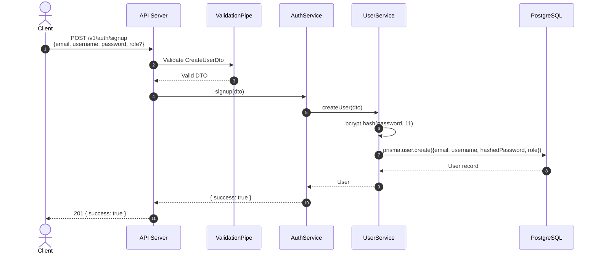
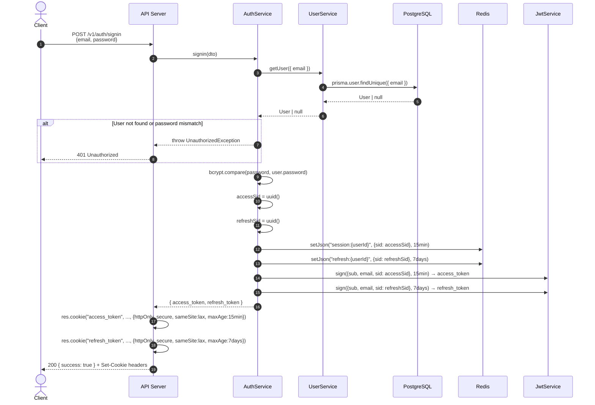
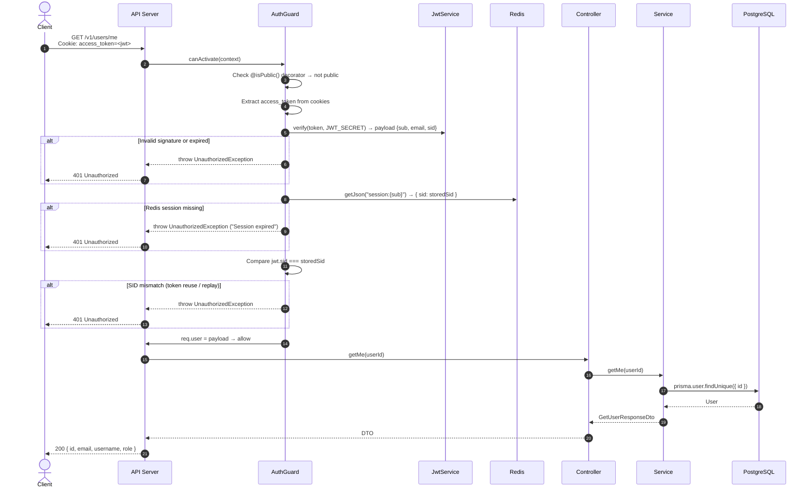
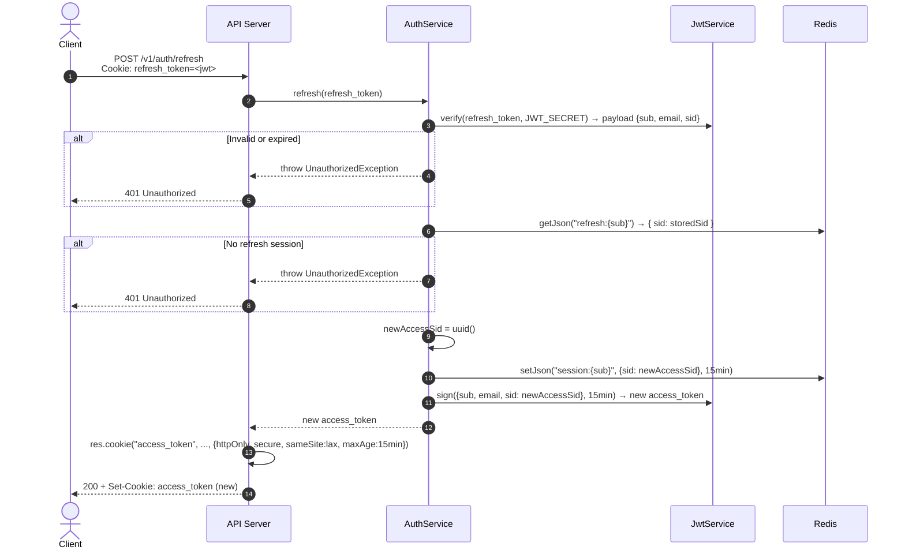
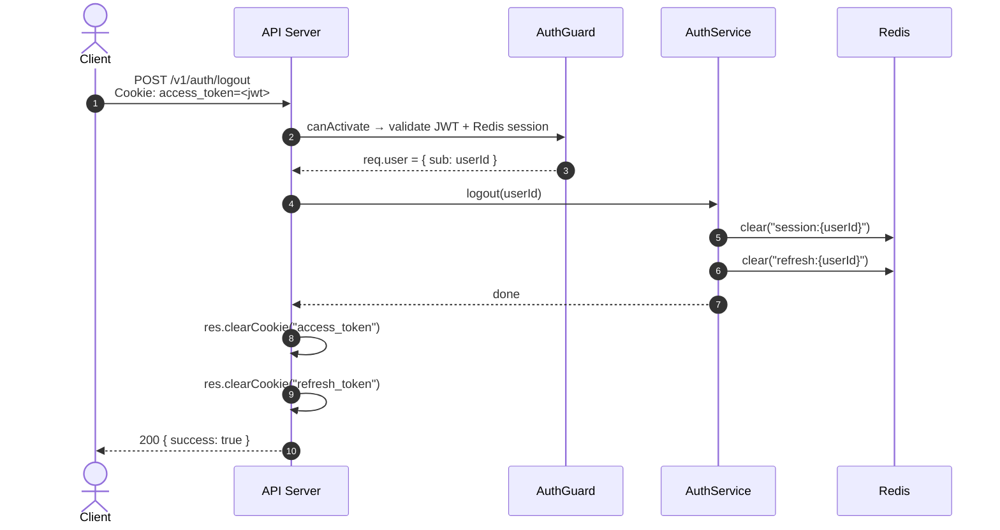
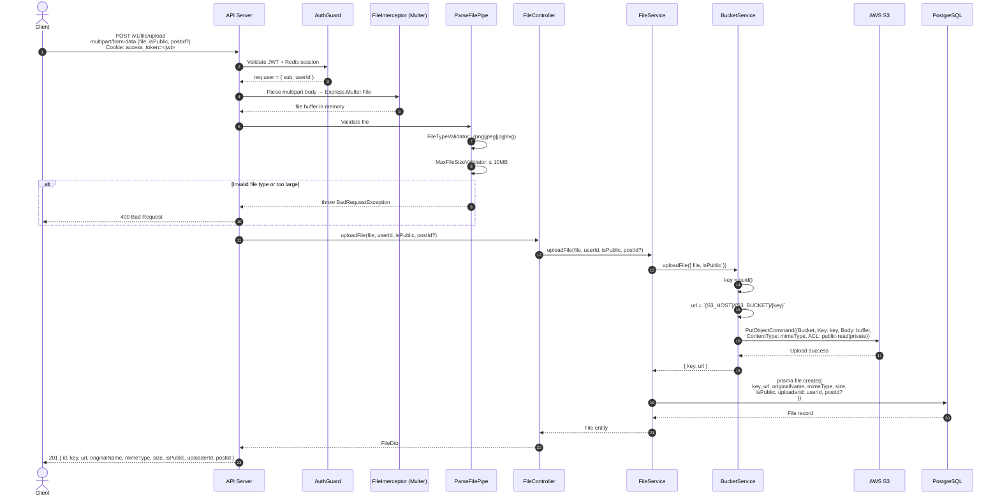
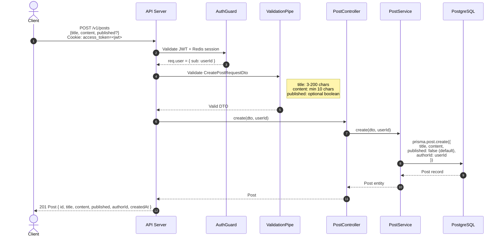

# NestGram — Sequence Diagrams

> Generated: 2026-03-09

---

## Table of Contents

1. [Sign Up](#1-sign-up)
2. [Sign In](#2-sign-in)
3. [Authenticated Request (JWT + Redis)](#3-authenticated-request-jwt--redis-validation)
4. [Token Refresh](#4-token-refresh)
5. [Logout](#5-logout)
6. [File Upload to S3](#6-file-upload-to-s3)
7. [Create Post](#7-create-post)

---

### 1. Sign Up

---

### 2. Sign In

---

### 3. Authenticated Request (JWT + Redis Validation)

---

### 4. Token Refresh

---

### 5. Logout

---

### 6. File Upload to S3

---

### 7. Create Post

